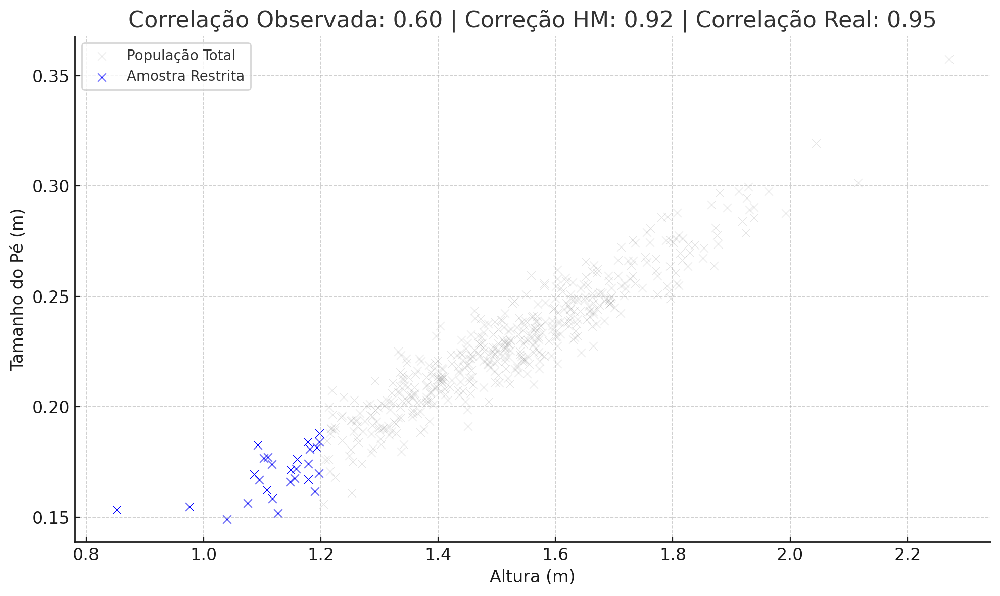

# Range Restriction Correlation Correction — HM Formula

This project demonstrates the practical implementation of the **HM (Hindemburg Melão Jr.) formula** for correcting Pearson's correlation in cases with **range restriction**, such as homogeneous or limited samples, where the observed correlation may be underestimated.

- [Leia-me em português do Brasil](README_pt_BR.md)
- [Readme](README_en_US.md)

---

